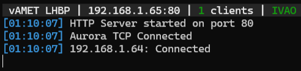

# vAMET for LHBP

[](https://github.com/drandrew112/vAMET_LHBP)

A Node.js and TypeScript-based tool for virtual air traffic controllers. This tool provides a highly realistic meteorological panel, replicating the layout and logic of the systems used in real-world Budapest (LHBP) operations.

Currently we have IVAO support only but working on a VATSIM support too.

---

## 📸 Screenshots
### User Interface

#### ATIS warnings

### Server Console


---

## ✨ Features

*   **Realistic Display:** Designed to look and feel similar to the actual meteorological monitor used in Budapest (LHBP).
*   **IVAO Integration**
    * Native ATIS readout directly from Aurora ATC software.
*   **VATSIM Integration**
    * Work in progress...
*   **ATIS warnings**
    *   **Transition Level:** Automatic calculation based on the current QNH.
    *   **Runway Direction Check:** Monitors optimal runway usage based on wind direction and speed.
*   **Real-time Updates:** Constant synchronization between the server and the display.
*   **Fully customizable**
    *   You can use this project as a template and customize for your airport.

---

## 🚀 Installation & Usage

### Requirements
*   [Node.js](https://nodejs.org)

### 1. Install Dependencies
Open a CMD where you unpacked the files
```bash
npm install
```

### 2. Build the Project
Compile the TypeScript source code:
```bash
tsc -p .
```

### 3. Start the Server
```bash
node index.js
```

---

## 🛠️ Tech Stack
*   **Backend:** [Node.js](https://nodejs.org)
*   **Languages:** TypeScript & JavaScript & HTML
*   **APIs used:** [AviationWeather.gov](AviationWeather.gov) & [IVAO Aurora 3rd party support](https://wiki.ivao.aero/en/home/devops/manuals/Aurora-3rd-parties-documentation)

---

⚠️ **WARNING:** This tool is for simulation use only! It is NOT intended for real-world aviation or air traffic control purposes!